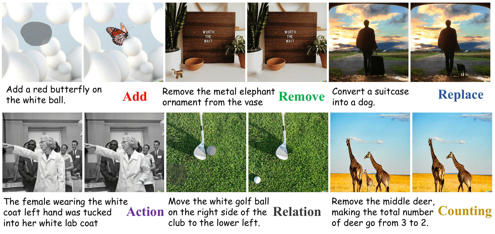

# HumanEdit: A High-Quality Human-Rewarded Dataset for Instruction-based Image Editing


[](https://arxiv.org/abs/2410.08261)
[](https://huggingface.co/datasets/BryanW/HumanEdit)
[](https://github.com/viiika/HumanEdit/)
[](https://viiika.github.io/HumanEdit/)

## 🚀 Introduction

We present HumanEdit, a high-quality, human-rewarded dataset specifically designed for instruction-guided image editing, enabling precise and diverse image manipulations through open-form language instructions. Previous large-scale editing datasets often incorporate minimal human feedback, leading to challenges in aligning datasets with human preferences. HumanEdit bridges this gap by employing human annotators to construct data pairs and administrators to provide feedback. With meticulously curation, HumanEdit comprises 5,751 images and requires more than 2,500 hours of human effort across four stages, ensuring both accuracy and reliability for a wide range of image editing tasks. The dataset includes **six distinct types of editing instructions: Action, Add, Counting, Relation, Remove, and Replace**, encompassing a broad spectrum of real-world scenarios. All images in the dataset are accompanied by masks, and for a subset of the data, we ensure that the instructions are sufficiently detailed to support mask-free editing. Furthermore, HumanEdit offers comprehensive diversity and high-resolution 1024 x 1024 content sourced from various domains, setting a new versatile benchmark for instructional image editing datasets. With the aim of advancing future research and establishing evaluation benchmarks in the field of image editing, we release HumanEdit at https://huggingface.co/datasets/BryanW/HumanEdit.

## 📚 Dataset Overview




## 📦 Citation

If you find this dataset useful, please consider citing:

```bibtex
@article{bai2024humanedit,
  title={HumanEdit: A High-Quality Human-Rewarded Dataset for Instruction-based Image Editing},
  author={Bai, Jinbin and Chow, Wei and Yang, Ling and Li, Xiangtai and Li, Juncheng and Zhang, Hanwang and Yan, Shuicheng},
  journal={arXiv preprint arXiv:2412.04280},
  year={2024}
}
```


